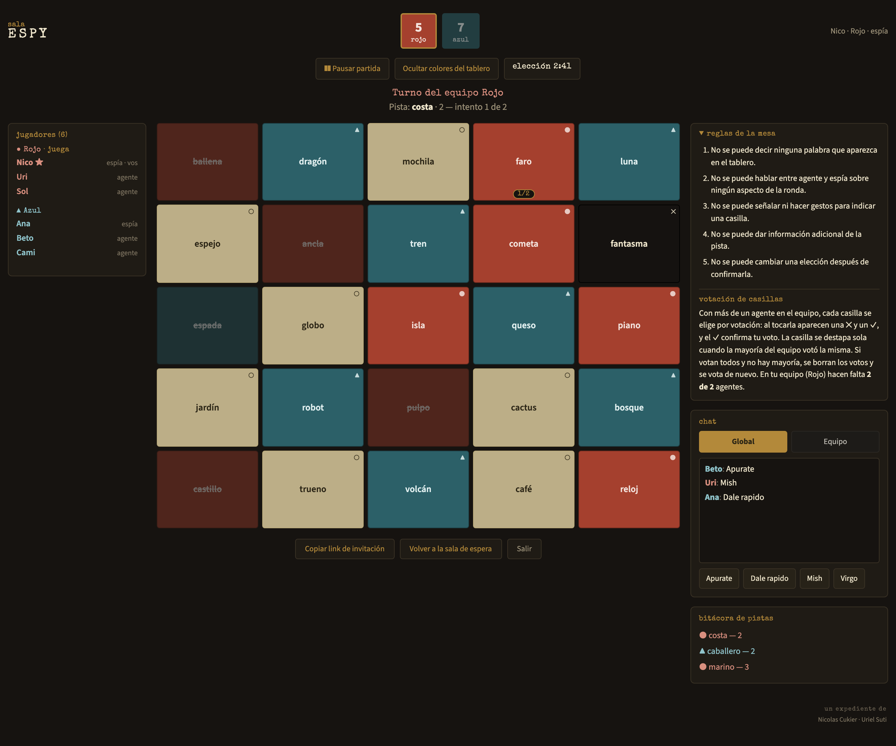

# Código Secreto

Codenames online y en castellano, para jugar con amigos cada uno desde su pantalla.

**👉 Jugá acá: https://secreto-aed7e.web.app**

No hace falta cuenta ni instalar nada: alguien crea una sala, comparte el link y el resto entra.



*Así ve la partida el espía del equipo rojo. Los agentes ven las mismas palabras, pero sin los colores.*

## Cómo se juega

- Se arman equipos. Cada uno tiene un **espía** (el líder) y uno o más **agentes** (los miembros).
- En el tablero hay palabras de cada equipo, casillas **neutrales** y **bombas**. Solo los espías
  saben de quién es cada una.
- En su turno, el espía da una pista de **una sola palabra** y un número. «Playa 3» quiere decir
  «hay tres palabras de nuestro equipo que tienen que ver con playa».
- Los agentes eligen casillas. El número de la pista es la cantidad de intentos.
- Gana el equipo que descubre todas sus palabras. El que toca una bomba queda afuera.

La pista no puede ser una palabra del tablero, y durante la partida no se puede hacer señas ni
dar información de más: las reglas completas están en el juego.

## Qué tiene

- **De 2 a 4 equipos** (rojo, azul, amarillo y verde). Con más equipos, el tablero crece.
- **Modificadores** que elige quien crea la sala:
  - cuántas bombas hay;
  - si tocar una casilla neutral o del rival corta el turno o no;
  - reloj para el espía y para los agentes;
  - si el color de cada casilla se ve al instante o recién al terminar el turno.
- **Votación** cuando hay varios agentes en un equipo: una casilla se elige cuando la vota la mayoría.
- **Chat global** con mensajes rápidos, y **chat de equipo** escrito solo entre agentes, sin el espía.
- **Pausa** para toda la mesa, y un botón para que el espía oculte los colores si alguien le mira la pantalla.
- **Unas 980 palabras** distintas.

## Para desarrollar

Hace falta Node 20.19 o más nuevo (lo pide Vite).

```bash
npm install
npm run dev     # abre el juego en http://localhost:5173
npm test        # tests de la lógica del juego
```

> **Ojo:** tal como está, `npm run dev` usa la misma base de Firebase que el sitio publicado, así
> que las salas que crees son reales. Para probar sin tocarla, dejá vacío `databaseURL` en
> `src/firebaseConfig.js`: el juego pasa a un modo local donde las salas se comparten entre
> pestañas del mismo navegador.

### Publicar

```bash
npx firebase-tools@latest login     # la primera vez
npm run build && npx firebase-tools@latest deploy --only hosting
```

## Cómo está hecho

- **React 19 + Vite** para la interfaz.
- **Firebase Realtime Database** guarda el estado de cada sala, y **Firebase Hosting** sirve el sitio.
- Toda la lógica del juego vive en [`src/game.js`](src/game.js): es un reducer puro, sin React ni
  red, que corre dentro de las transacciones de Firebase. Así, si dos jugadores tocan algo al mismo
  tiempo, no se pisan.

El detalle de la arquitectura, las decisiones de diseño y las cosas que ya dieron problemas está
en [`CLAUDE.md`](CLAUDE.md).

La `apiKey` de [`src/firebaseConfig.js`](src/firebaseConfig.js) no es un secreto: las claves web
de Firebase son públicas por diseño y viajan igual en el código del sitio. Lo que protege la base
son las reglas de [`database.rules.json`](database.rules.json).

## Autores

Hecho por **Nicolas Cukier** y **Uriel Suti**.
